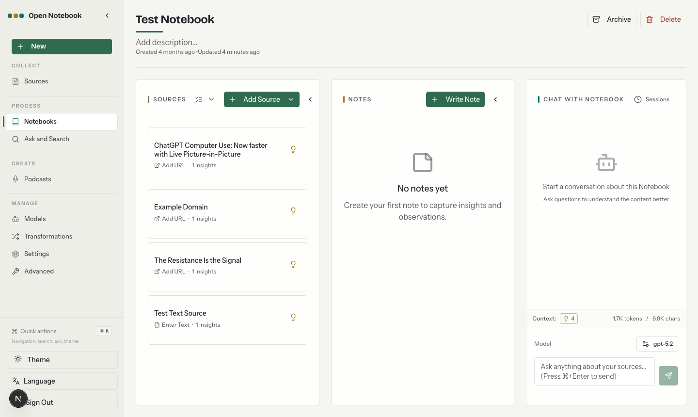

<a id="readme-top"></a>

<!-- [![Contributors][contributors-shield]][contributors-url] -->
[![Forks][forks-shield]][forks-url]
[![Stargazers][stars-shield]][stars-url]
[![Issues][issues-shield]][issues-url]
[![MIT License][license-shield]][license-url]
<!-- [![LinkedIn][linkedin-shield]][linkedin-url] -->


<!-- PROJECT LOGO -->
<br />
<div align="center">
  <a href="https://github.com/lfnovo/open-notebook">
    
  </a>

  <h3 align="center">Open Notebook</h3>

  <p align="center">
    An open source, privacy-focused alternative to Google's Notebook LM!
    <br /><strong>Join our <a href="https://discord.gg/37XJPXfz2w">Discord server</a> for help, to share workflow ideas, and suggest features!</strong>
    <br />
    <a href="https://www.open-notebook.ai"><strong>Checkout our website »</strong></a>
    <br />
    Follow <a href="https://x.com/lfnovo">@lfnovo on X</a> for updates
    <br />
    <br />
    <a href="docs/0-START-HERE/index.md">📚 Get Started</a>
    ·
    <a href="#-fork-enhancements">⭐ Fork Enhancements</a>
    ·
    <a href="docs/3-USER-GUIDE/index.md">📖 User Guide</a>
    ·
    <a href="docs/2-CORE-CONCEPTS/index.md">✨ Features</a>
    ·
    <a href="docs/1-INSTALLATION/index.md">🚀 Deploy</a>
  </p>
</div>

<p align="center">
<a href="https://trendshift.io/repositories/14536" target="_blank"></a>
</p>

<div align="center">
  <!-- Keep these links. Translations will automatically update with the README. -->
  <a href="https://zdoc.app/de/lfnovo/open-notebook">Deutsch</a> | 
  <a href="https://zdoc.app/es/lfnovo/open-notebook">Español</a> | 
  <a href="https://zdoc.app/fr/lfnovo/open-notebook">français</a> | 
  <a href="https://zdoc.app/ja/lfnovo/open-notebook">日本語</a> | 
  <a href="https://zdoc.app/ko/lfnovo/open-notebook">한국어</a> | 
  <a href="https://zdoc.app/pt/lfnovo/open-notebook">Português</a> | 
  <a href="https://zdoc.app/ru/lfnovo/open-notebook">Русский</a> | 
  <a href="https://zdoc.app/zh/lfnovo/open-notebook">中文</a>
</div>

## A private, multi-model, 100% local, full-featured alternative to Notebook LM

<!-- KEEP ON UPSTREAM MERGE: this fork section must survive merges from lfnovo/open-notebook. -->
> [!NOTE]
> **About this fork**: this repository is an enhanced fork of [lfnovo/open-notebook](https://github.com/lfnovo/open-notebook). It carries everything upstream plus fork-only enhancements — a Gemini/NotebookLM-style studio workspace, a task center with live progress inspection, one-click study artifacts, full-library export/import, a built-in MCP server, and extra providers (Zhipu, Xiaomi MiMo). See the [Fork Enhancements](#-fork-enhancements) overview below. For bugs in fork-specific features, report to [Genmer/open-notebook/issues](https://github.com/Genmer/open-notebook/issues); general project discussions stay upstream. The multilingual translations and the website linked below describe the upstream project and may not cover fork additions.



In a world dominated by Artificial Intelligence, having the ability to think 🧠 and acquire new knowledge 💡, is a skill that should not be a privilege for a few, nor restricted to a single provider.

**Open Notebook empowers you to:**
- 🔒 **Control your data** - Keep your research private and secure
- 🤖 **Choose your AI models** - Support for 25 providers including OpenAI, Anthropic, Ollama, LM Studio, Xiaomi MiMo, Zhipu, and more
- 📚 **Organize multi-modal content** - PDFs, videos, audio, web pages, and more
- 🎙️ **Generate professional podcasts** - Advanced multi-speaker podcast generation
- 🔍 **Search intelligently** - Full-text and vector search across all your content
- 💬 **Chat with context** - AI conversations powered by your research
- 🌐 **Multi-language UI** - English, Portuguese, Chinese (Simplified & Traditional), Japanese, Russian, and Bengali support

Learn more about our project at [https://www.open-notebook.ai](https://www.open-notebook.ai)

---

## 🆚 Open Notebook vs Google Notebook LM

| Feature | Open Notebook | Google Notebook LM | Advantage |
|---------|---------------|--------------------|-----------|
| **Privacy & Control** | Self-hosted, your data | Google cloud only | Complete data sovereignty |
| **AI Provider Choice** | 25 providers (OpenAI, Anthropic, Ollama, LM Studio, etc.) | Google models only | Flexibility and cost optimization |
| **Podcast Speakers** | 1-4 speakers with custom profiles | 2 speakers only | Extreme flexibility |
| **Studio Artifacts** | Study guides, FAQs, flashcards & essay drafts generated into notes | Study guide/Briefing doc/audio overview | More artifact types, fully under your control |
| **Content Transformations** | Custom and built-in | Limited options | Unlimited processing power |
| **API Access** | Full REST API | No API | Complete automation |
| **Deployment** | Docker, cloud, or local | Google hosted only | Deploy anywhere |
| **Citations** | Enhanced references with per-source titles and finer control | Comprehensive with sources | Research integrity |
| **Customization** | Open source, fully customizable | Closed system | Unlimited extensibility |
| **Cost** | Pay only for AI usage, with per-model cost estimates | Free tier + Monthly subscription | Transparent and controllable |

**Why Choose Open Notebook?**
- 🔒 **Privacy First**: Your sensitive research stays completely private
- 💰 **Cost Control**: Choose cheaper AI providers or run locally with Ollama
- 🎙️ **Better Podcasts**: Full script control and multi-speaker flexibility vs limited 2-speaker deep-dive format
- 🔧 **Unlimited Customization**: Modify, extend, and integrate as needed
- 🌐 **No Vendor Lock-in**: Switch providers, deploy anywhere, own your data

### Built With

[![Python][Python]][Python-url] [![Next.js][Next.js]][Next-url] [![React][React]][React-url] [![SurrealDB][SurrealDB]][SurrealDB-url] [![LangChain][LangChain]][LangChain-url]

## 🚀 Quick Start (2 Minutes)

### Prerequisites
- [Docker Desktop](https://www.docker.com/products/docker-desktop/) installed
- That's it! (API keys configured later in the UI)

> [!IMPORTANT]
> This fork publishes no prebuilt images. The upstream `lfnovo/open_notebook` image runs **upstream code only** — none of the fork enhancements. Deploy from this repository so the app is built locally with fork features included.

### Step 1: Get the code
```bash
git clone https://github.com/Genmer/open-notebook.git
cd open-notebook
```

### Step 2: Configure
```bash
cp .env.example docker.env
```
Edit `docker.env` and change this line:
```
OPEN_NOTEBOOK_ENCRYPTION_KEY=change-me-to-a-secret-string
```
to any secret value (e.g., `my-super-secret-key-123`). The file already ships working local defaults for the database connection.

### Step 3: Start Services
```bash
docker compose -f examples/docker-compose-dev.yml --project-directory . up -d --build
```
Equivalent to `make dev`. This starts SurrealDB plus the app — built locally from this repository, so every fork feature is included. The first build takes a few minutes.

Wait 15-20 seconds after the build finishes, then open: **http://localhost:8502**

<details>
<summary>Alternative: app-only compose with a standalone database container</summary>

The root [`docker-compose.yml`](docker-compose.yml) builds only the app and expects SurrealDB as a standalone container on the same compose network:

```bash
# start just the database (network alias: surrealdb)
docker compose -f examples/docker-compose-dev.yml --project-directory . up -d surrealdb
# build & start the app (joins the same default network)
docker compose up -d --build
```
</details>

> [!TIP]
> **Upload limits**: the API accepts request bodies up to 1 GB by default (`OPEN_NOTEBOOK_MAX_UPLOAD_SIZE_MB`), and import-package decompression is capped at 4 GB (`OPEN_NOTEBOOK_MAX_IMPORT_UNCOMPRESSED_MB`) — both adjustable. A fronting reverse proxy's own limit still applies. See the [environment variable reference](docs/5-CONFIGURATION/environment-reference.md).

### Step 4: Configure AI Provider
1. Go to **Models** and choose your provider (OpenAI, Anthropic, Google, etc.)
2. Click **+ Add Configuration**
3. Paste your API key and other info as needed and click **Add Configuration**
4. Click **Test** to test connection
5. Click **Sync Models** and check models to include
6. Under **Default Model Assignments**, click **Auto-Assign Defaults** or manually specify which models to use for what 

Done! You're ready to create your first notebook.

> **Need an API key?** Get one from:
> [OpenAI](https://platform.openai.com/api-keys) · [Anthropic](https://console.anthropic.com/) · [Google](https://aistudio.google.com/) · [Groq](https://console.groq.com/) (free tier)

> **Want free local AI?** See [examples/docker-compose-ollama.yml](examples/docker-compose-ollama.yml) for Ollama setup

---

### 📚 More Installation Options

- **[With Ollama (Free Local AI)](examples/docker-compose-ollama.yml)** - Run models locally without API costs
- **[From Source (Developers)](docs/1-INSTALLATION/from-source.md)** - For development and contributions
- **[Complete Installation Guide](docs/1-INSTALLATION/index.md)** - All deployment scenarios

---

## Star History

[](https://star-history.dera.page/#lfnovo/open-notebook&type=date&legend=top-left)


## Provider Support Matrix

Thanks to the [Esperanto](https://github.com/lfnovo/esperanto) library, we support this providers out of the box!

| Provider     | LLM Support | Embedding Support | Speech-to-Text | Text-to-Speech |
|--------------|-------------|------------------|----------------|----------------|
| OpenAI       | ✅          | ✅               | ✅             | ✅             |
| Anthropic    | ✅          | ❌               | ❌             | ❌             |
| Groq         | ✅          | ❌               | ✅             | ❌             |
| Google (GenAI) | ✅          | ✅               | ✅             | ✅             |
| Vertex AI    | ✅          | ✅               | ❌             | ✅             |
| Ollama       | ✅          | ✅               | ❌             | ❌             |
| oMLX         | ✅          | ✅               | ❌             | ❌             |
| ElevenLabs   | ❌          | ❌               | ✅             | ✅             |
| Deepgram     | ❌          | ❌               | ✅             | ✅             |
| Azure OpenAI | ✅          | ✅               | ✅             | ✅             |
| Mistral      | ✅          | ✅               | ✅             | ✅             |
| DeepSeek     | ✅          | ❌               | ❌             | ❌             |
| Cohere       | ✅          | ✅               | ❌             | ❌             |
| Voyage       | ❌          | ✅               | ❌             | ❌             |
| xAI          | ✅          | ❌               | ❌             | ✅             |
| OpenRouter   | ✅          | ✅               | ✅             | ✅             |
| DashScope (Qwen) | ✅      | ✅               | ❌             | ❌             |
| Zhipu (BigModel) | ✅      | ✅               | ❌             | ❌             |
| Xiaomi MiMo** | ✅         | ✅               | ✅             | ✅             |
| Xiaomi MiMo Token Plan** | ✅ | ✅            | ✅             | ✅             |
| MiniMax      | ✅          | ❌               | ❌             | ❌             |
| Novita       | ✅          | ❌               | ❌             | ❌             |
| PayPerQ (PPQ) | ✅          | ✅               | ✅             | ✅             |
| OpenAI Compatible* | ✅          | ✅               | ✅             | ✅             |
| Anthropic Compatible* | ✅     | ❌             | ❌             | ❌             |

*Supports LM Studio and any OpenAI-compatible / Anthropic-compatible endpoint. Prefer the native **oMLX** provider for [oMLX](https://omlx.ai/) (Apple Silicon); see [docs/5-CONFIGURATION/omlx.md](docs/5-CONFIGURATION/omlx.md).

**MiMo's audio models are served over the chat-completions protocol rather than the standard `/audio/*` endpoints; this fork ships dedicated adapters for that.

## ✨ Key Features

### Core Capabilities
- **🔒 Privacy-First**: Your data stays under your control - no cloud dependencies
- **🎯 Multi-Notebook Organization**: Manage multiple research projects seamlessly, with nested source folders and AI-assisted classification
- **📚 Universal Content Support**: PDFs, videos, audio, web pages, Office docs, and more
- **🤖 Multi-Model AI Support**: 25 providers including OpenAI, Anthropic, Ollama, Google, LM Studio, Zhipu, Xiaomi MiMo, and more
- **🎙️ Professional Podcast Generation**: Advanced multi-speaker podcasts with Episode Profiles
- **🔍 Intelligent Search**: Full-text and vector search across all your content
- **💬 Context-Aware Chat**: AI conversations powered by your research materials
- **📝 AI-Assisted Notes**: Generate insights or write notes manually

### Advanced Features
- **⚡ Reasoning Model Support**: Full support for thinking models like DeepSeek-R1 and Qwen3
- **🛠️ Task Center & Live Progress**: Every async job (insights, embeddings, imports, podcasts) in one place, with live progress inspection, token rate and multi-stage progress
- **🎓 Study Artifacts**: One-click study guides, FAQs, flashcards and essay drafts generated from your sources and saved back as notes
- **💾 Full-Library Export / Import**: One-click backup and restore of notebooks, sources, notes, vectors and files, with conflict-aware import and model-configuration migration
- **🔌 Built-in MCP Server**: Expose your notebooks to coding agents via `python -m open_notebook.mcp_server` — see [MCP server docs](docs/5-CONFIGURATION/mcp-server.md)
- **🩺 AI Task Diagnostics**: Failed tasks explain what happened, the likely root cause and how to fix it, with recovery checks and one-click retry
- **📊 Usage, Cost & Storage Dashboards**: Daily token trends, per-model cost estimates and on-disk storage analytics
- **🔧 Content Transformations**: Powerful customizable actions to summarize and extract insights
- **🌐 Comprehensive REST API**: Full programmatic access for custom integrations [](http://localhost:5055/docs)
- **🔐 Optional Password Protection**: Secure public deployments with authentication
- **📊 Fine-Grained Context Control**: Choose exactly what to share with AI models
- **📎 Citations**: Get answers with proper source citations


## ⭐ Fork Enhancements

<!-- KEEP ON UPSTREAM MERGE: this fork section must survive merges from lfnovo/open-notebook. -->
Everything below is added by this fork on top of upstream. Each item links to the feature mention above or to its docs when user docs exist.

| Enhancement | What you get |
|-------------|--------------|
| [Gemini-style Studio workspace](docs/3-USER-GUIDE/gemini-workspace.md) | NotebookLM-like three-column view (folder tree / chat / studio) alongside the classic view, switchable in settings |
| [Task Center & Live Inspector](docs/3-USER-GUIDE/task-center.md) | All async operations in one page; live progress terminal with stage status, token rate, multi-stage progress |
| [Study Artifacts](#-key-features) | Study guides, FAQs, flashcards, essay drafts — generated asynchronously and saved back as notes |
| [AI Task Diagnostics](#-key-features) | Failed jobs get a four-part explanation (what / why / how to fix / next actions) with recovery detection and retry |
| [Full-Library Export / Import v2](docs/3-USER-GUIDE/data-migration.md) | Backup & migrate everything (including model configs and API keys, conflict-confirmed) across instances |
| [Built-in MCP Server](docs/5-CONFIGURATION/mcp-server.md) | Let Claude Code and other MCP clients search and chat with your notebooks |
| [Folders & multi-view organization](docs/3-USER-GUIDE/folders.md) | Nested source folders, AI content/filename classification, file-type views, bulk operations |
| [Usage, cost & storage dashboards](docs/3-USER-GUIDE/storage-usage.md) | Token trends, heatmaps, per-model cost estimates (CNY), storage analytics with export-size estimation |
| [New providers](#provider-support-matrix) | Zhipu (BigModel), Xiaomi MiMo & MiMo Token Plan (full modality incl. chat-audio), DashScope embeddings |
| Detailed fork changelog | Every batch of fork changes, in Chinese: [本地定制记录](#本地定制记录) |

**Contents**: [Quick Start](#-quick-start-2-minutes) · [vs Notebook LM](#-open-notebook-vs-google-notebook-lm) · [Provider Matrix](#provider-support-matrix) · [Key Features](#-key-features) · [Documentation](#-documentation) · [Roadmap](#-roadmap) · [本地定制记录](#本地定制记录)

## Podcast Feature

[](https://www.youtube.com/watch?v=D-760MlGwaI)

## 📚 Documentation

### Getting Started
- **[📖 Introduction](docs/0-START-HERE/index.md)** - Learn what Open Notebook offers
- **[⚡ Quick Start with OpenAI](docs/0-START-HERE/quick-start-openai.md)** - Get up and running in 5 minutes
- **[🔧 Installation](docs/1-INSTALLATION/index.md)** - Comprehensive setup guide
- **[🎯 Run It Fully Local](docs/0-START-HERE/quick-start-local.md)** - Ollama/LM Studio, completely private

### User Guide
- **[📱 Interface Overview](docs/3-USER-GUIDE/interface-overview.md)** - Understanding the layout
- **[📚 Notebooks, Sources & Notes](docs/2-CORE-CONCEPTS/notebooks-sources-notes.md)** - Organizing your research
- **[📄 Adding Sources](docs/3-USER-GUIDE/adding-sources.md)** - Managing content types
- **[📝 Working with Notes](docs/3-USER-GUIDE/working-with-notes.md)** - Creating and managing notes
- **[💬 Chatting Effectively](docs/3-USER-GUIDE/chat-effectively.md)** - AI conversations
- **[🔍 Search](docs/3-USER-GUIDE/search.md)** - Finding information
- **[✨ Gemini Workspace](docs/3-USER-GUIDE/gemini-workspace.md)** - NotebookLM-style three-column view
- **[📋 Task Center](docs/3-USER-GUIDE/task-center.md)** - Tracking background operations
- **[📤 Data Migration](docs/3-USER-GUIDE/data-migration.md)** - Export and import your library
- **[🗂️ Folders](docs/3-USER-GUIDE/folders.md)** - Organizing sources with folders
- **[💾 Storage Usage](docs/3-USER-GUIDE/storage-usage.md)** - Understanding what takes up space

### Advanced Topics
- **[🎙️ Podcast Generation](docs/2-CORE-CONCEPTS/podcasts-explained.md)** - Create professional podcasts
- **[🔧 Content Transformations](docs/3-USER-GUIDE/transformations.md)** - Customize content processing
- **[🤖 AI Models](docs/4-AI-PROVIDERS/index.md)** - AI model configuration
- **[🔌 MCP Integration](docs/5-CONFIGURATION/mcp-integration.md)** - Connect with Claude Desktop, VS Code and other MCP clients
- **[⌨️ Built-in MCP Server](docs/5-CONFIGURATION/mcp-server.md)** - Expose your notebooks to coding agents (fork feature)
- **[🔧 REST API Reference](docs/7-DEVELOPMENT/api-reference.md)** - Complete API documentation
- **[🔐 Security](docs/5-CONFIGURATION/security.md)** - Password protection and privacy
- **[🚀 Deployment](docs/1-INSTALLATION/index.md)** - Complete deployment guides for all scenarios
- **[🧭 Vision & Principles](VISION.md)** - What Open Notebook is, and where it's going
- **[🛠️ Developer Docs](docs/7-DEVELOPMENT/index.md)** - Architecture, setup, contributing, decision records

### Configuration & Operations
- **[⚙️ Environment Variables](docs/5-CONFIGURATION/environment-reference.md)** - Every setting, including upload limits and worker tuning
- **[🧩 Configuration Index](docs/5-CONFIGURATION/index.md)** - All configuration topics
- **[🌐 Reverse Proxy Setup](docs/5-CONFIGURATION/reverse-proxy.md)** - nginx / Traefik / Caddy examples

### Troubleshooting
- **[🚑 Quick Fixes](docs/6-TROUBLESHOOTING/quick-fixes.md)** - 5-minute troubleshooting guide
- **[❓ FAQ](docs/6-TROUBLESHOOTING/faq.md)** - Common questions and solutions

<p align="right">(<a href="#readme-top">back to top</a>)</p>

## 🗺️ Roadmap

> This is the upstream project roadmap. Fork-specific plans live in the [fork roadmap (中文)](#后续体验优化与新功能规划路线图-roadmap) at the bottom of this file.

### Upcoming Features
- **Global Realtime Push**: SSE/WebSocket-driven UI updates (task-level live progress already shipped in this fork — see [Fork Enhancements](#-fork-enhancements))
- **Cross-Notebook Sources**: Reuse research materials across projects
- **Bookmark Integration**: Connect with your favorite bookmarking apps

### Recently Completed ✅
- **Next.js Frontend**: Modern React-based frontend with improved performance
- **Comprehensive REST API**: Full programmatic access to all functionality
- **Multi-Model Support**: 25 AI providers including OpenAI, Anthropic, Ollama, LM Studio
- **Advanced Podcast Generator**: Professional multi-speaker podcasts with Episode Profiles
- **Content Transformations**: Powerful customizable actions for content processing
- **Enhanced Citations**: Improved layout and finer control for source citations
- **Multiple Chat Sessions**: Manage different conversations within notebooks

Explore [GitHub Discussions](https://github.com/lfnovo/open-notebook/discussions/categories/ideas) for proposed features and product ideas, and [open Issues](https://github.com/lfnovo/open-notebook/issues) for known bugs and approved work.

<p align="right">(<a href="#readme-top">back to top</a>)</p>


## 📖 Need Help?
- **🤖 AI Installation Assistant**: We have a [CustomGPT built to help you install Open Notebook](https://chatgpt.com/g/g-68776e2765b48191bd1bae3f30212631-open-notebook-installation-assistant) - it will guide you through each step!
- **New to Open Notebook?** Start with our [Getting Started Guide](docs/0-START-HERE/index.md)
- **Need installation help?** Check our [Installation Guide](docs/1-INSTALLATION/index.md)
- **Something broken?** Try the [5-minute troubleshooting guide](docs/6-TROUBLESHOOTING/quick-fixes.md) or the [FAQ](docs/6-TROUBLESHOOTING/faq.md)

## 🤝 Community & Contributing

### Join the Community
- 💬 **[Discord Server](https://discord.gg/37XJPXfz2w)** - Get help, share ideas, and connect with other users
- 𝕏 **[Follow @lfnovo on X](https://x.com/lfnovo)** - Project updates and news from the maintainer
- 💡 **[GitHub Discussions](https://github.com/lfnovo/open-notebook/discussions)** - Ask questions and shape features, product direction, design, and architecture
- 🐛 **[Report fork bugs](https://github.com/Genmer/open-notebook/issues)** - Reproducible issues with fork-specific features go to this fork's tracker; upstream bugs go to [lfnovo/open-notebook/issues](https://github.com/lfnovo/open-notebook/issues)
- ⭐ **Star this repo** - Show your support and help others discover Open Notebook

### Contributing
We welcome contributions! We're especially looking for help with:
- **Frontend Development**: Help improve our modern Next.js/React UI
- **Testing & Bug Fixes**: Make Open Notebook more robust
- **Feature Development**: Build the coolest research tool together
- **Documentation**: Improve guides and tutorials

**Current Tech Stack**: Python, FastAPI, Next.js, React, SurrealDB
**Future Roadmap**: Real-time updates, enhanced async processing

See our [Contributing Guide](CONTRIBUTING.md) for detailed information on how to get started, including our guidelines for [AI-assisted contributions](docs/7-DEVELOPMENT/contributing.md#ai-assisted-and-agent-generated-prs). To understand what we're building (and what we'll say no to), read [VISION.md](VISION.md).

<p align="right">(<a href="#readme-top">back to top</a>)</p>


## 📄 License

Open Notebook is MIT licensed. See the [LICENSE](LICENSE) file for details.

<p align="right">(<a href="#readme-top">back to top</a>)</p>


<!-- MARKDOWN LINKS & IMAGES -->
<!-- https://www.markdownguide.org/basic-syntax/#reference-style-links -->
[contributors-shield]: https://img.shields.io/github/contributors/lfnovo/open-notebook.svg?style=for-the-badge
[contributors-url]: https://github.com/lfnovo/open-notebook/graphs/contributors
[forks-shield]: https://img.shields.io/github/forks/lfnovo/open-notebook.svg?style=for-the-badge
[forks-url]: https://github.com/lfnovo/open-notebook/network/members
[stars-shield]: https://img.shields.io/github/stars/lfnovo/open-notebook.svg?style=for-the-badge
[stars-url]: https://github.com/lfnovo/open-notebook/stargazers
[issues-shield]: https://img.shields.io/github/issues/lfnovo/open-notebook.svg?style=for-the-badge
[issues-url]: https://github.com/lfnovo/open-notebook/issues
[license-shield]: https://img.shields.io/github/license/lfnovo/open-notebook.svg?style=for-the-badge
[license-url]: LICENSE
[linkedin-shield]: https://img.shields.io/badge/-LinkedIn-black.svg?style=for-the-badge&logo=linkedin&colorB=555
[linkedin-url]: https://linkedin.com/in/lfnovo
[Next.js]: https://img.shields.io/badge/Next.js-000000?style=for-the-badge&logo=next.js&logoColor=white
[Next-url]: https://nextjs.org/
[React]: https://img.shields.io/badge/React-61DAFB?style=for-the-badge&logo=react&logoColor=black
[React-url]: https://reactjs.org/
[Python]: https://img.shields.io/badge/Python-3776AB?style=for-the-badge&logo=python&logoColor=white
[Python-url]: https://www.python.org/
[LangChain]: https://img.shields.io/badge/LangChain-3A3A3A?style=for-the-badge&logo=chainlink&logoColor=white
[LangChain-url]: https://www.langchain.com/
[SurrealDB]: https://img.shields.io/badge/SurrealDB-FF5E00?style=for-the-badge&logo=databricks&logoColor=white
[SurrealDB-url]: https://surrealdb.com/

---

## 本地定制记录

> 本节为本地 fork 的定制改动记录，合并上游时请保留本节。每批改动完成后在此追加一条。

### 2026-10-07：项目环境详情弹窗结构化视觉重排
弹窗内容从「小标题+纯文本竖排」升级为按字段定制的可视化（纯前端抽取，抽不到自动回退纯文本卡，real 手输任意文本不打崩）：头部时间范围改横向时间轴条（起止标签+身份色轨道+月数徽标）；规模/背景散落数字抽成关键指标卡行（如 15人/2.8万条/6000家门店，X→Y 改善型带趋势箭头图标与读屏文案）；技术背景抽成技术栈瓦片卡（名称+版本+类别图标，叙述降为次级 muted 文本）；本人角色抽头衔出角色卡，与规模卡同排；调优过程渲染为编号纵向流程图（语境节点+步骤+成果节点带改善 chips，原文折叠可展开）；问题与解决渲染为 warn 问题卡→fern 解决卡的纵叠配对。通用开头结尾与验证详情折叠区保持原样，弹窗加宽至 3xl。抽取层 frontend/src/lib/utils/env-structure.ts 为纯函数零依赖零抛错；新增 7 个 i18n key 补齐 14 locale。

### 2026-10-06：README 待办四连发（断点续传/段落引用/对比脑图/音频批注）
落地路线图剩余四项：①大包导入重构为分片上传（PUT /chunks 哈希校验+uploaded_chunks 断点续传+complete 校验），解除 100MB 单请求体限制；②AI 回答引用升级为段落级锚点：点击引用→GET /sources/{id}/locate-passage 免模型定位（全角折叠 6-gram 匹配）→`?cite=` 跳转详情页，PDF 逐页搜文本层高亮命中 span、文本路径段落锚点+banner；③新增 comparison/mindmap 两种学习产物（LLM 输出 markdown 大纲→确定性转树），MindmapViewer 纯 SVG 左右脑图（点节点折叠、+N 徽标、零新依赖），对比产物含并排差异表/共识/分歧/阅读建议，对比不足两源时禁用并提示；④音频源详情页新增 AudioTranscriptViewer（播放器+结构化分段排版+按字符占比的播放联动句级高亮+点击句子跳播+一键摘录进笔记），播客转写弹窗内嵌播放器联动高亮与一键复制。涉及：commands/{data_transfer,artifact}_commands.py、utils/passage_locate.py、text-locate.ts、transcript-sync.ts、mindmap-layout.ts、CiteHighlightedText.tsx、AudioTranscriptViewer.tsx、MindmapViewer.tsx、PdfSourceViewer.tsx 等，14 locale 全量补键。

### 2026-10-06：导出体验三件套（预估/流式下载/按笔记本课题包）
落地路线图「数据管理与备份体验增强」前三项：①导出弹窗实时预估（GET /api/data-transfer/export/estimate，计数与附件字节精确统计、文本/向量采样均值×压缩系数估算 ~包体积与明细）；②导出包下载改 fetch 直连流式读取，实时显示已下载字节与百分比进度条；③新增 scope="notebooks" 按笔记本勾选导出课题包（经 reference/artifact 边与向量按笔记本过滤，共享表全量保留以保幂等导入），导出边集顺带补齐 refers_to（聊天会话引用边）。涉及：commands/data_transfer_commands.py、api/data_transfer_service.py、api/routers/data_transfer.py、ExportCard.tsx、dataTransfer.ts、14 locale。

### 2026-09-22：向量化参数设置页
设置页"嵌入与搜索"新增 4 个向量化参数（分块大小/重叠/最小块/批量），DB>环境变量>默认值动态生效，改后免重启。涉及：open_notebook/utils/embedding_config.py、api/routers/settings.py、SettingsForm.tsx。

### 2026-09-22：智谱 provider 与 DashScope 域名支持
新增智谱（Zhipu BigModel）供应商（国内版，credential base_url 可切 Coding Plan 域名）；DashScope 百炼专属域名文档与 credential 模型发现修复。涉及：open_notebook/ai/provider_registry.py、open_notebook/ai/__init__.py、api/credentials_service.py。

### 2026-09-22：嵌入进度与 Token 统计
source 嵌入改为按批落库，详情页实时进度（x/y 块）+失败可见；新增全模型 token 用量统计（设置页 Usage 子页，LLM 全计+embedding 估算，可关闭可清空）。涉及：commands/embedding_commands.py、open_notebook/ai/usage.py、SourceEmbeddingProgress.tsx、settings/usage/。

### 2026-09-22：处理管道分步可视化
源详情页新增 4 步处理管道 stepper（提取/嵌入/洞察转换/完成），各步独立状态与进度，失败步可就地重试。涉及：api/routers/sources.py、api/models.py、SourceProcessingSteps.tsx。

### 2026-09-22：外观主题切换
设置页新增外观卡片，支持主题切换（会话前已有的本地定制，补记录）。涉及：AppearanceCard.tsx、theme-store.ts、theme-script.ts、ThemeProvider.tsx。

### 2026-09-22：Token 用量页仪表盘化
设置页 Usage 子页改为仪表盘风格（参考 Claude 用量页）：引入 recharts，新增按模型分色的每日趋势折线、模型占比环形图（中心总量+百分比图例）、近半年 GitHub 风格热力图、大数字汇总卡（智能单位）、7/30/90 天范围切换；后端 summary 接口新增日×模型聚合。涉及：api/usage_service.py、frontend/src/components/usage/、settings/usage/page.tsx。

### 2026-09-22：对话回车发送开关与嵌入未完成提醒
对话输入区新增「回车发送」持久化开关（默认关；开启后 Enter 发送、Shift+Enter 换行，含中文输入法/Safari 选词防误发），关闭时维持 Cmd/Ctrl+Enter 发送且页面写明；笔记来源卡片在嵌入失败/部分/未嵌入时右侧显示红色提醒，点击跳转详情页重新嵌入。涉及：ChatPanel.tsx、chat-preferences-store.ts、SourceCard.tsx。

### 2026-09-22：转换规则双语显示与聊天引用显示标题
6 条预置转换规则显示为「英文（中文）」（如 Dense Summary（稠密摘要），自建规则原样）；AI 回复底部引用列表由 source:id 改为显示来源标题（无标题回退文件名），新增 GET /api/sources/titles 批量查询端点。涉及：transformation-display.ts、source-references.tsx、api/routers/sources.py。

### 2026-09-23：一键重新嵌入与来源多视图分组
来源页新增「一键嵌入全部未完成」（missing 模式原子认领防重复提交，下方实时排队进度，可捞回卡死状态）；来源新增多视图分组体系（迁移 29）：文件类型（按文件后缀分组 PDF/DOCX/EXCEL 等，固定只读）/ AI 内容分类（向量聚类+一次 LLM 命名，约 2k token）/ AI 文件名分类 / 自定义四个独立视图，分组可嵌套（深度 5），支持多选批量移动/复制（深拷贝含向量零 token）/级联删除，笔记本来源列同步分组导航。涉及：embedding_commands.py、classification_commands.py、clustering.py、source_group_service.py、SourceViewTabs/GroupTree/BulkActionBar。

### 2026-09-23：数据导出/导入
新增整库打包导出与导入（`/settings/data` 入口）：笔记本/来源/笔记/洞察/转换规则/视图分组/向量/上传文件导出为单个 zip（manifest 严格校验+sha256，凭据与 command 表物理排除），导入按 id 整条跳过实现幂等（同包连导两次零写入，绝不覆盖已有数据），文件流式解压+哈希校验后重写 asset 路径，进度走 data_transfer_state 表（迁移 30）实时轮询。注意：新增命令模块 data_transfer_commands.py 需重启 surreal-commands-worker 才会注册。涉及：commands/data_transfer_commands.py、api/data_transfer_service.py、api/routers/data_transfer.py。

### 2026-09-23：来源文件夹操作补全与术语更名、笔记本新增来源可选目标文件夹
来源页补全文件管理器操作全集：行内重命名/移动/复制/移出/删除菜单、批量规则重命名（前缀/后缀/查找替换）与批量删除、当前位置面包屑、行拖拽入夹与文件夹拖拽调层级、Shift 范围勾选；「分组」术语统一更名「文件夹」（14 语言）；添加来源对话框新增可选目标文件夹（创建后两步入组，非原子由前端警示兜底）。后端经逐一对照零改动：所需端点与深度/环/重名校验均已存在（无迁移、无新命令、无需重启 worker）。涉及：frontend/src/app/(dashboard)/sources/page.tsx、frontend/src/components/sources/、frontend/src/lib/locales/。

### 2026-09-24：来源/文件夹右键菜单（重命名、新建文件夹、移动到文件夹）
笔记本详情页来源卡片、/sources 页表格行、GroupTree 文件夹节点三处新增右键菜单（打开/重命名/移动到文件夹/新建文件夹等，一套内容组件复用）；移动弹窗 GroupPickerDialog 支持内联即时新建文件夹并自动选中（顺带修复零文件夹时确认键永久禁用的死局）；SourceCard ⋮ 菜单同步补齐三项防两入口能力漂移；引入 @radix-ui/react-context-menu。后端零改动：所需端点（PUT /sources/{id}、views/groups CRUD、POST /groups/{gid}/members|copy、POST /views/{vid}/ungroup）均已存在且测试覆盖，source.title 的 BM25 索引随写入自动维护。涉及：frontend/src/components/ui/context-menu.tsx、frontend/src/components/sources/、frontend/src/app/(dashboard)/notebooks/components/SourcesColumn.tsx、frontend/src/lib/locales/。

### 2026-09-24：来源视图家族化与笔记本页文件夹条目区（文件浏览器范式统一）
「视图」术语从用户可见文案退场：/sources 页标签区改三段家族（我的文件夹/✨AI 自动分类/按文件类型，段下常驻解释 hint，AI 段前置"重新分类会覆盖手动调整"警示）；笔记本页来源列「视图+文件夹」双下拉简化为单下拉「整理方式」（选项按家族分组），选定后卡片列表上方新增文件夹条目区 FolderRail（空文件夹也显示、计数徽章含 0，位于滚动容器外不影响分页/无限滚动）+ 面包屑，与 /sources 页共享 GroupTree 数据层、右键菜单、弹窗状态机（use-group-dialogs）；新建文件夹弹窗显示落点路径与同级夹列表、重名即时禁用；未选视图时新建自动落 custom 视图并切入高亮（修复此前静默落进 AI Content、Re-classify 一跑即被覆盖）；同级重名的后端英文报错映射为中文提示；AI 视图显示名改「按内容/按文件名」（走 displayViewName i18n 间接层，DB 名不动）。后端零改动（本批逐一复核）：views/groups CRUD、move/copy/ungroup、classify 与防环/深度≤5/重名校验均已存在，重名错误串在 create/update 两处一致（api/source_group_service.py:234,266），group_id 筛选为直接成员精确匹配（api/routers/sources.py:582-586）；无迁移、无新命令、无需重启 worker。涉及：frontend/src/app/(dashboard)/notebooks/components/SourcesColumn.tsx、frontend/src/app/(dashboard)/sources/page.tsx、frontend/src/components/sources/（FolderRail/GroupBadge/use-group-dialogs/SourceViewTabs/GroupTree/GroupNameDialog）、frontend/src/lib/utils/error-handler.ts、frontend/src/lib/locales/。

### 2026-09-23：Token 用量页改版（后端口径修正）
用量汇总接口按请求时区切日：summary 新增 tz_offset 参数（分钟，JS 符号，UTC+8 传 480），day 桶与窗口边界从 UTC 日改为本地日（写入侧 day 字段仍按 UTC，明细展示用 created 本地化，两种日界自此统一）；新增 previous_totals 上一等长周期聚合（环比）与 totals/by_model 的 estimated_tokens（embedding 估算量在聚合位可见）；WHERE 条件由 day 字符串比较改为 created 时间戳阈值。写入侧、明细与清空接口、worker 均无改动。涉及：api/usage_service.py、api/routers/usage.py、api/models.py、tests/test_usage_api.py。

### 2026-09-24：字体自托管（构建离线化）
next build 生产构建需联网拉 Google Fonts，本机直连不通导致构建失败（门禁无代理环境必挂）。5 个字体（Instrument Sans/Bricolage Grotesque/Spline Sans Mono/Geist/Geist Mono）改为本地 latin variable woff2 自托管，layout.tsx 从 next/font/google 切到 next/font/local，variable 名与权重范围保持不变（视觉零变化，display 补显式 swap 与原默认一致），构建从此离线可跑。涉及：frontend/src/app/layout.tsx、frontend/src/app/fonts/。

### 2026-09-24：文件夹体验第 1 轮评审修复（两页范式对齐）
修复评审发现：命名弹窗 onConfirm 现真正返回 Promise（后端拒绝时保持打开可重试，两页建夹/重命名改 mutateAsync）；右键内联新建子夹成功后有落点 toast（「已在『父夹』内创建…」）；笔记本页浏览中的视图/文件夹被他页删除时自动回退根层/全部视图（不再卡幽灵位置）；深度上限前端三道防线（建夹入口限深禁用、移动弹窗按"目标深度+子树高>5"预置灰、后端 400 映射中文）+ MAX_GROUP_DEPTH 前端常量统一到 group-tree.ts；/sources 新建文件夹落点改为当前浏览文件夹（与笔记本页文件浏览器语义一致，弹窗落点提示/同级列表同步）；笔记本来源列表加 keepPreviousData（进出文件夹不再整列闪 loading）；移动弹窗空文件夹也显示 0 计数；无自定义视图的全新用户右键建夹自动先创建「我的文件夹」视图（绝不落进会被 AI 重分类覆盖的视图）；高亮计时改为新夹渲染出来后才开始；zh-CN/zh-TW/en-US 清掉 aiOverwriteHint 与重分类确认里的「视图」措辞（改「文件夹集」）。后端零改动。涉及：frontend/src/components/sources/（GroupDialogs/FolderRail/GroupTree/GroupPickerDialog/folder-parity.test）、frontend/src/app/(dashboard)/notebooks/components/SourcesColumn.tsx、frontend/src/app/(dashboard)/sources/page.tsx、frontend/src/lib/（hooks/use-sources.ts、utils/group-tree.ts、utils/error-handler.ts、locales/×14）。

### 2026-09-25：笔记本页双列文件管理器交互与添加来源文件夹预填
彻底重构笔记本详情页交互：废除原来源列内下拉框与大瓷砖网格遮盖卡片的繁琐交互，改为经典双列文件管理器范式。左侧新增独立可折叠的文件夹侧栏列 FoldersColumn（树形层级、数量徽章、增删改查菜单、视图切换、支持 w-60/w-12 独立收起），右侧来源列 SourcesColumn 始终直观展示对应来源卡片，点击左侧文件夹即时联动过滤并展示面包屑导航；添加来源对话框第 1 步前置曝光折叠条 FolderTargetSection，直观展示目标文件夹并支持直接修改，在特定文件夹下添加时自动预填上下文，填完 URL/文件后在第 1 步直接点完成即可落盘归档；空文件夹显示空态引导按钮。涉及：frontend/src/app/(dashboard)/notebooks/components/（FoldersColumn.tsx、SourcesColumn.tsx）、frontend/src/components/sources/（FolderTargetSection.tsx、AddSourceDialog.tsx）、notebook-columns-store.ts。

### 2026-09-25：数据导出包包含系统设置与提示词配置
完善数据备份与容灾：将通用系统设置 `open_notebook:content_settings`（处理引擎、向量化切块参数、Docling OCR/公式/视觉开关、Token 审计开关等）与全局自定义提示词 `open_notebook:default_prompts` 纳入数据导出与导入链路（分别生成 data/content_settings.ndjson 与 data/default_prompts.ndjson），导入时通过 UPSERT MERGE 安全还原合并，保持向后兼容老版本导出包，且物理隔离私有凭据。涉及：commands/data_transfer_commands.py、tests/test_data_transfer_commands.py。

### 2026-09-26：内置 MCP 服务器（把本库暴露给编程代理）
新增 `python -m open_notebook.mcp_server`（fastmcp 提为直接依赖，stdio 传输）：暴露 4 只读 + 1 写工具——list_notebooks / list_sources / search（复用 domain 层 text_search+vector_search 与作用域解析，文本失败自动向量回退）/ chat（单轮 Prompter+vector_search 组装上下文，复用 ask/query_process 模板与 tools 默认模型，不引入 langgraph 会话，用量计入 mcp_chat）/ add_note（Note 落库并入组，仅此一个写操作）。Claude Code 一行接入：`claude mcp add open-notebook -- uv run --directory /path/to/open-notebook python -m open_notebook.mcp_server`。配置片段与工具表见 [docs/5-CONFIGURATION/mcp-server.md](docs/5-CONFIGURATION/mcp-server.md)。涉及：open_notebook/mcp_server.py、pyproject.toml、uv.lock、docs/5-CONFIGURATION/mcp-server.md、docs/5-CONFIGURATION/mcp-integration.md、tests/test_mcp_server.py。

### 2026-09-28：任务失败答疑 AI（恢复判定 + AI 重试 + 嵌入冲突误判修复）
任务中心失败任务新增"为什么失败？"答疑入口：POST /api/explain 按 12k token 预算组装材料（任务实况、实体当前态、known_issues 知识库、用量元数据）送 qa 模型槽位（缺省回退 chat），输出脱敏四段式解释（What happened / Likely root cause / How to fix / Next actions）与行动建议，LRU 缓存 50 条/TTL 10 分钟、信号量限并发 3、90s 超时降级不报 500；前端 TaskExplainCard 渐变【AI 分析】徽章 + thinking 动效。恢复判定以实体当前态为准（命令行无时间戳可用）：源嵌入 completed 且 embedded=total、source_view last_classified_at、transfer 阶段 done、同实体后续成功任务四种口径，已恢复任务显示"当前已正常"提示并隐藏重试按钮；"AI 重试"携带 check_recovery 预检（已恢复则跳过提交并刷新判定），另保留手动重试（generate_podcast 除外，防重复生成）。配套修复 embed_source 的 RuntimeError 分支误判：SurrealDB 事务冲突（repository 层裸 RuntimeError，可重试）此前被转成 ValueError 永久失败导致源永久卡 queued，现按冲突消息特征分流为临时失败走命令级重试（红宝书 642 块源已实测恢复）。i18n 14 语言全量补齐，前后端字段契约测试双向锁定。涉及：api/routers/explain.py、api/explain_service.py、api/command_service.py、api/routers/commands.py、commands/embedding_commands.py、prompts/qa/、frontend/src/components/tasks/TaskExplainCard.tsx、frontend/src/lib/hooks/use-explain.ts、frontend/src/lib/api/（explain.ts、tasks.ts）、frontend/src/app/(dashboard)/tasks/page.tsx、frontend/src/messages/×14、tests/（test_explain_api.py、test_explain_contract.py、test_tasks_api.py、test_embed_source_progress.py 及前端 TaskExplainCard 测试）、[ADR-013](docs/7-DEVELOPMENT/decisions/ADR-013-task-failure-explain-ai.md)。

### 2026-09-28：小米 MiMo 全模态放开 + chat-audio 音频适配器
小米两家供应商（xiaomi_mimo / xiaomi_mimo_token_plan）模态声明从 language-only 放开到全四种（provider_registry modalities + UI 下拉），配套新增 chat-audio 适配器打通其音频模型——MiMo 的 TTS/ASR 不在 OpenAI 标准 /audio/* 端点上（实测 404），而是走 chat/completions 协议（TTS：assistant 角色消息承载文本，响应 message.audio.data 为 base64 WAV；ASR：input_audio content part 且严禁 text part，响应 message.content 为转写）。实现 open_notebook/ai/xiaomi_audio.py 两个适配器类挂入 AIFactory 私有 provider 表（register_openai_compatible_profile 只覆盖 /audio/* 协议族；esperanto profile 的 capabilities 相应收回 language+embedding，防止 create_tts/stt 优先命中 404 路径），podcast_creator 直连 AIFactory 与连接测试器两条消费链路同时覆盖；每 provider 一个薄子类承载默认 host 与 env key 契约。实测：mimo-v2.5-tts 真实合成成功、mimo-v2.5-asr 转写测试音频 "Hello there."。涉及：open_notebook/ai/xiaomi_audio.py、open_notebook/ai/__init__.py、open_notebook/ai/provider_registry.py、tests/test_xiaomi_audio.py。

### 2026-09-29：失败任务行直出重试/AI 重试按钮
任务中心失败行不再要求先点"为什么失败？"才能重试：行上直接渲染【重试】（强制重放）与【AI 重试】（携带 check_recovery 恢复预检，已恢复则后端跳过提交并 toast 提示），是否可重试由任务列表接口新下发的 retryable 字段决定（command 是否在 RETRYABLE_COMMANDS 白名单，generate_podcast 永不可重试，前后端单一事实来源），explain 分析卡内按钮保持不变。涉及：api/task_service.py、api/models.py、frontend/src/lib/api/tasks.ts、frontend/src/app/(dashboard)/tasks/page.tsx、tests/test_tasks_api.py 及前端任务页测试。

### 2026-09-29：模型配置导出/导入（含 API Key，冲突确认式导入）
数据管理新增"仅模型配置"导出（凭据+模型+默认模型分配，包格式 v2：manifest.package_type、format_version=2，v1 包仍可导入），整体导出可勾选"包含模型配置"；凭据 API Key 经用户拍板以**明文**进包（导出解密写入，导入用本机 OPEN_NOTEBOOK_ENCRYPTION_KEY 重加密入库，任一解密失败整体快速失败，UI 明示风险），反转 ADR-011 凭据物理排除政策（见 [ADR-014](docs/7-DEVELOPMENT/decisions/ADR-014-model-config-export-import.md)）。导入改为两阶段：上传即冲突扫描（API 进程内解析+本地 diff，sha256 绑定包字节防串包），同 id 且指纹不同的凭据/模型逐项确认跳过/覆盖（默认跳过，credential 覆盖仅 api_key/config/modalities），default_models MERGE 应用+悬空指针置空警告；同指纹静默跳过保幂等。顺带把 import_data 移出任务中心可重试名单（永久失败删包后重试必 FileNotFoundError）。实测闭环：仅模型导出→改坏本地凭据 key→重扫描报冲突→覆盖导入→密文恢复且解密一致。同日追加进度可视化：导出/导入写入结构化进度 detail（当前表/文件名/向量块数+序号）与 stages 阶段统计持久化（每阶段行内嵌 x/y 或结果统计，刷新不丢），前端按语言模板渲染实时活动行（替代原样显示英文日志）；摘要计数表名本地化（17 表 ×14 语言）并显示总用时；导出摘要的"文件被跳过"可展开查看明细（来源 ID+文件路径+原因 invalid_path/missing_on_disk，上限 100 条），可据此定位跨环境迁移的失效附件。涉及：commands/data_transfer_commands.py、api/routers/data_transfer.py、api/data_transfer_service.py、api/models.py、api/explain_service.py、frontend/src/components/settings/data/（ExportCard、ImportCard、ImportConflictDialog 新增、TransferStageList）、frontend/src/lib/api/dataTransfer.ts、frontend/src/lib/hooks/use-data-transfer.ts、frontend/src/lib/locales/×14、tests/（test_data_transfer_commands、test_data_transfer_api、test_data_transfer_scan 新增）、[ADR-014](docs/7-DEVELOPMENT/decisions/ADR-014-model-config-export-import.md)（新增，ADR-011 标注部分被取代）。

### 2026-09-29：Gemini Notebook (NotebookLM) 风格三栏工作台与文件夹层级展示
复刻 Google NotebookLM 交互形态，系统设置新增"笔记详情页面风格"切换（Open NoteBook 默认经典 vs Gemini Notebook 现代三栏，Zustand 本地持久化且无需刷新即时生效），详情页解耦为 ClassicNotebookView 与 GeminiNotebookView 双视图共享底层数据 Hooks。左侧来源彻底重构为**文件夹树形层级展示**（文件夹展开/折叠、所属来源统计徽标、文件夹三态 Checkbox 级联批量勾选、未归档资源独立分类），并引入 Web Research 智能导源入口；中间 Chat 增加 AI 回复底部常驻【保存为笔记】与划词存笔记交互；右侧 Studio 设立成熟功能矩阵（Audio Overview 直连生成播客、Study Guide / FAQ / Briefing Doc / Flashcards 直连后端 generate_artifact 异步命令生成并自动回流入库为笔记，实时轮询与状态响应），配合卡片流笔记管理；同日追加：**生成任务进度管理**——点击生成后不再原地转圈，对话框切换为进度详情视图（状态徽标/进度条/已用时长/实时消息/任务ID），提供【打开进度管理】跳转任务中心与【后台运行，关闭】按钮，工具箱标题栏常驻进度管理入口，本地 5 分钟轮询窗口后引导至任务中心继续跟踪；文件夹徽标改为"本笔记本数/知识库总数"双数字口径、来源右键全套菜单（移动/重命名/移除/删除/打开）完整移植、左栏加宽至 380/420px 且修复 flex `min-h-0` 缺失导致的树区不可滚动、右栏 Studio 接入 CollapsibleColumn 支持收起为窄条（与经典视图笔记栏共享持久化折叠状态）。**数据修复**：排查出 9月24日两批共 16 个文件（论文 9 + 红宝书 7）经"无笔记本上下文"上传入口写入、仅落全局文件夹而从未建立笔记本关联；已重新挂回笔记本（24→40 个文件），并在 AddSourceDialog 增加"选文件夹未选笔记本时自动推断唯一笔记本"逻辑消除同类隐患（多笔记本保留拦截），配套后端回归测试锁定关联契约。涉及：frontend/src/app/(dashboard)/notebooks/[id]/page.tsx、ClassicNotebookView、GeminiNotebookView、GeminiSourcesColumn、GeminiStudioColumn、AddSourceDialog、sources.ts、api/routers/sources.py、MessageActions、AppearanceCard、notebook-view-store、14国语言包及配套组件单元测试。

### 2026-09-30：任务进度管理深度重构与大模型实时流式观测 (Live Inspector)
彻底治理任务中心与生成弹窗中长耗时命令（工件生成/播客/抓取处理）进度缺失的黑盒痛点：
1. **真实数据连通**：`TaskLiveInspector` 接入真实后端 `GET /api/commands/jobs/{id}/live-progress` 接口，1.5 秒自动轮询，彻底消灭纯前端定时器假数据；
2. **大模型实时流式观测**：支持实时显示大模型当前正在输出的文本流片段（打字机光标效果）、多阶段流水线指示（已完成/进行中/待处理）、已耗时秒表、Token 速率（tok/s）与调用模型名称，解决长耗时推理中无法感知模型是否在运转的卡死焦虑；
3. **任务中心体验升级**：在 `/tasks` 页面对所有状态的任务（运行中/已完成/失败/排队）均提供【查看实时进展】与【执行详情】抽屉展开入口，并展示多阶段进度条与阶段徽标；
4. **Studio 弹窗无缝复用**：生成任务提交后，弹窗就地转化为进度详情与实时监视视图，提供【后台运行】与【打开进度管理 ↗】无缝跳转。
涉及：frontend/src/components/tasks/TaskLiveInspector.tsx、frontend/src/app/(dashboard)/tasks/page.tsx、frontend/src/lib/api/tasks.ts、GeminiStudioColumn.tsx、api/task_service.py、api/routers/commands.py 及全套单元测试。

### 2026-10-06：数据导出导入范围维护约定（新表必须纳入）
确立 fork 级约定：**今后所有新增的"项目数据相关"表（用户创建/编辑的领域数据，如智能体、项目环境这类）上线时必须同步加入数据导出/导入范围**——即 `commands/data_transfer_commands.py` 中的 `DATA_TABLES` / `EDGE_TABLES` 等清单，保证备份与跨机迁移不丢用户资产（聊天历史、任务记录、用量统计属刻意排除项，不受此约束）。当前已知缺口：`agent`（智能体）与 `project_env`（软考项目环境）两张表尚未纳入导出，属待办，本次仅在代码白名单处加注释立约，暂不扩表。

### 2026-10-07：项目环境模拟验证语义重设计（第一性原则：逻辑合理 + 技术前沿、防穿帮）
按"mock 项目是 AI 虚构背景，验收标准 = 逻辑自洽 + 技术选型在项目周期前已 GA 且较新（防论文穿帮）"重设计验证语义：mock 模式不再跑 A 路（本地知识库证据——虚构项目必然无证据、永远过不了），只跑 B/C 两路；B 路（GA 锚点）判定规则重写——纯金额/日期/叙事句直接 pass（不再误判"不在锚点表"），锚点表查不到的技术在 mock 模式下按常识判断"period_start 前是否已公开发布可用于生产"（禁 off_table），material 模式保持 off_table 进人工；`check_ga_ordering` 新增大版本匹配（"Spring Boot 3" 取该大版本最早 GA，最保守），GA 锚点表补充 vllm 0.6 / milvus 2.4；mock 生成提示词加"选型必须在 period_start 前 GA、前提下优先较新版本"约束；单点模型调用/解析失败不再抛 RuntimeError 整单 failed，降级为 needs_review 下 reason_code=llm_error 的待人工断言（前端 14 语言新增"模型调用失败，请重试验证"标签），可走重试验证恢复；rewrite 端点对 mock 环境同步只过 B/C；空知识库不再阻断 mock 生成与验证（mock 链路零知识库读取，API 422 守卫与 worker fail-fast 均已移除）。涉及：`commands/project_env_commands.py`、`open_notebook/ai/project_env_pipeline.py`、`open_notebook/domain/project_env_rules.py`、`api/routers/project_envs.py`、`prompts/project_env/verify_b.jinja`、`prompts/project_env/mock_generate.jinja`、`frontend/src/components/project-envs/VerificationPanel.tsx` 与全部 locale 文件。

### 2026-10-07：AI 扩写前新增"素材生成"步骤（素材拼装 + 路线选择双 Tab，人工决策后再扩写验证）
在 AI 模拟项目"关键词直接扩写"之前插入素材生成环节，多生成候选让用户参与决策：`POST /api/project-envs/mock-generate` 新增 `flow=materials`（缺省 `direct` 行为不变），新 worker 命令 `generate_project_env_materials` 在一次 run 内顺序生成两类候选（素材/路线各 1 次 LLM 调用，token 围栏 + 进度走围栏 UPDATE）——六类字段 × 3 条事实性素材片段 + 3 条差异化完整路线 spec（技术栈/规模/角色三轴分化、周期落合法时间窗、GA 早于项目期）；服务端按 TEXT_FIELDS 白名单过滤 category（丢弃不报错）、统一重编号 m1../r1..、下限素材≥6 条/路线≥2 条否则整单 failed 可重试。新状态 material_pending/material_ready：`GET /verification` 的 pending 自愈结构性不受波及（素材期非 pending），改由 `GET /{id}/materials` 自带孤儿自愈（job 终态未写回 → failed + 引导重试，复刻枚举 .value 解包）；`POST /{id}/materials/generate` 支持 material_ready/failed/needs_review/verified 重试重做（清旧草稿/快照/晋升文本/陈旧选择，候选 store 保留至覆盖）；`POST /{id}/materials/submit` 把用户选择（素材多选 ids 或路线单选 id，校验链 not_generated/empty_selection/unknown_ids/missing_route_id/invalid_combination）落库 `materials_selection`（迁移 38 新增两个 FLEXIBLE object 字段）并清空旧产物重入 pending，走既有 drafting→双路验证→verified 管线——drafting 步骤按 selection 分流到新提示词 `draft_from_materials`/`draft_from_route`（选中事实必须保留进对应字段/路线 spec 严格取自原值），选择失配自动回退关键词路径并告警，进度文案随分流切换；reverify/regenerate 运行态守卫扩展到 material_pending（409 分素材/验证两套文案），regenerate 兼作"跳过素材"keywords 直通逃生舱并清理陈旧 selection。前端创建向导新增素材步骤：素材多选 Tab（按六类分组、全选/计数/至少 1 条）与路线单选 Tab（差异徽标 + 可展开亮点预览），提交后进入既有验证步骤，14 语言全覆盖。涉及：`commands/project_env_commands.py`、`commands/__init__.py`、`open_notebook/ai/project_env_pipeline.py`、`open_notebook/domain/project_env.py`、`api/models.py`、`api/routers/project_envs.py`、`open_notebook/database/migrations/38(.down).surrealql` 与 `async_migrate.py`、`prompts/project_env/`（materials_generate/routes_generate/draft_from_materials/draft_from_route 四个新模板）、前端 CreateEnvWizard/MaterialSelectionStep/MaterialPickerTab/RoutePickerTab 及全部 locale 文件。

### 2026-10-07：素材生成步骤落地加固与全流程实测（截断/挂死兜底 + 小白死路修复）
双 Tab 功能实测暴露并修复一批问题：① 素材束是全管线最大单次 JSON 输出（18 条候选），`_invoke_json` 的 max_tokens 参数化（默认 4096）并在 `generate_materials` 提到 8192，防首次真实使用即截断解析失败；② 每次模型调用加 `LLM_CALL_TIMEOUT_SECONDS=900` 硬超时（`asyncio.wait_for` 包裹 ainvoke，超时按普通失败重试一次）——实测中网络中断会让挂起的连接永久悬挂、worker 成僵尸任务永远 running，900 秒取自实测素材大调用真实耗时 ~9 分钟之上；③ 素材就绪后补"换一批素材"（确认后清空两 Tab 选择并重生成，后端 `/materials/generate` 本就支持 material_ready 重入）与"跳过素材"（确认后 regenerate 直通）出口；④ 双 Tab 交叉选择提交确认——选了素材再采用路线（或反之）时弹确认说明将放弃另一 Tab 的选择，取消保留原状；⑤ mock 验证 stepper 文案改"双路验证"（real 仍"三路验证"）且断言点隐藏 A 路徽章（mock 不跑知识库证据路，逐点只显示 时间/语境）；⑥ failed 的 mock 环境重开向导落素材步骤（有 store 可重选重提交、无 store 走失败横幅重试/跳过）；⑦ 列表"重新生成"在 material_pending 期间禁用防并发分叉；⑧ "AI 模拟项目"描述文案修正为"生成逻辑自洽的虚构项目叙述"（原文案"基于本地知识库生成"已不符合第一性原则改造后的 mock 链路）。浏览器以用户身份全流程实测通过：新建→关键词→生成素材（含网络断连致 worker 僵尸→标记失败→失败横幅重试生成成功）→双 Tab 选择→交叉确认→提交→双路验证收敛 needs_review（55 点 18 过/27 超容量可移除/10 豁免，全点仅 B/C 通道）→"移除"处置生效。涉及：`open_notebook/ai/project_env_pipeline.py`、`frontend/src/components/project-envs/`（MaterialSelectionStep/VerificationPanel/CreateEnvWizard/ProjectEnvList/EnvDetailDialog 及测试）、全部 locale（新增 10 key ×14）。

### 2026-10-07：验证粒度段落化 + AI 修改建议 + 通用段落 + 导出导入 v3
① 验证点从"一句话一个点"改为"一个自然段一个点"（抽取/去重/漂移定位/GA 预审/三路验证/纠错/改写全链路），段内多组技术+版本合并一点、>800 字段落按句号装箱兜底——实测同一素材从 55 个句子点（27 个"超出验证容量"洪水）降到 6 个段落点且 6/6 全过收敛 verified；LLM 引文空白容错回咬原文精确子串（replace 字节精确）；GA 预审覆盖段内全部版本对并补守用户改写提交（上限 2000→4000）；dismiss 改确定性删整段（不再调 LLM 润色，字段仅剩此段时 409 引导改写），同物理行其余未决点联动结算为 dismissed（removed_with_paragraph）防死点卡环境。② 新增 AI 修改建议：needs_review 下仅 lanes_failed/exhausted 的待人工点显示【AI 修改】，无状态 suggest 端点按 B/C 失败意见生成"建议整段+说明"，前端上下堆叠纯 diff（原文/建议/理由），采纳填入改写框走既有重验流程，放弃即弃。③ 每环境新增"通用段落"：用户可手写或 AI 一键生成带 `____` 填空与 `<u>` 技法标记的可套用段落（编辑框内改后手动保存），live 注入 chat 上下文（跟随快照注入门、不进快照不触发重验、mock 重生成不清除），XSS 安全按字面渲染；同步 LLM 端点超时实测收紧到 600 秒（默认 chat 模型出长文 3 分钟+，180 会挡死）。④ project_env/project_env_verification 两表纳入数据导出导入（包版本 2→3）：导出全量业务字段含通用段落与最新一条验证记录（每环境仅最新，历史 run 不导），白名单剔除 verification_token/active_job_id/progress（导入后 fencing 双空自然可用）；导入 id-skip 幂等、重名警告仍导入、pending/material_pending 映射 failed 并提示重新验证、孤儿 run 跳过告警、旧 v1/v2 包零感知；详情弹窗保存后即时刷新（页面改存环境 id 派生数据防 stale snapshot）。浏览器以用户身份实测：通用段落生成→编辑→保存→即时刷新、改写预填、两次段落级全量验证收敛、导出包（122MB/33 秒，含项目环境：2/验证记录：2）落盘校验、注入文本含快照+通用段块全链路。涉及：`open_notebook/ai/project_env_pipeline.py`、`commands/project_env_commands.py`、`api/routers/project_envs.py`、`api/models.py`、`api/project_env_service.py`、`open_notebook/domain/project_env.py`、`migrations/39(.down)`、`commands/data_transfer_commands.py`、`prompts/project_env/`（extract/verify×3/corrector 改写 + suggest_rewrite/generic_paragraph 新增 + remove_supporting 删除）、前端 SuggestRewritePanel/GenericParagraphSection 新组件与 VerificationPanel/EnvDetailDialog/ProjectEnvList/project-environments 页、TransferStageList、全部 locale（20 key ×14）、ADR-015。

### 2026-10-07：mock 生成行业选择 + 公司自研视角 + 剔除合同金额/团队规模
① 向导 mock 第 2 步新增「公司所在行业」输入框（默认"物流行业"，≤20 字，localStorage `project-env-industry` 记忆上次选择，随提交持久化），值经 `MockGenerateRequest.industry` 落到 project_env 新字段 `industry`（migration 40，重生成沿用行内值不清空），API 响应同步返回。② 五条生成管线（整包 mock/素材/路线/素材成稿/路线成稿）模板全部注入 COMPANY CONTEXT 权威段：公司属于指定行业、一律"公司自研"视角（非乙方交付），并硬性禁写 合同金额/投资额/甲方乙方/外包/中标/验收回款/团队人数规模；背景与规模指引同步删去甲方/团队规模措辞，路线维度从"不同团队规模"改为"不同数据/用户规模"。③ 行业随环境进入数据导出导入白名单。浏览器以用户身份实测：默认行业与自定义行业（电商行业）两条链路，生成内容行业表述准确、违禁词全零、控制台零报错，环境行落库 industry 字段、重开向导默认值记忆生效。涉及：`migrations/40(.down)`、`open_notebook/database/async_migrate.py`、`open_notebook/domain/project_env.py`、`api/models.py`、`api/routers/project_envs.py`、`open_notebook/ai/project_env_pipeline.py`、`commands/project_env_commands.py`、`commands/data_transfer_commands.py`、`prompts/project_env/`（mock_generate/materials_generate/routes_generate/draft_from_materials/draft_from_route）、前端 CreateEnvWizard/lib types 与 API client、全部 locale（2 key ×14）、CHANGELOG。

---

## 后续体验优化与新功能规划路线图 (Roadmap)

> 基于多维度工程与交互体检提炼，聚焦本地优先、隐私友好与知识研读体验，待后续逐步落地实现。

### 1. 数据管理与备份体验增强
- [x] **导出包体积预估与文件明细预览（Export Size Estimation）**：在点击开始导出前，自动扫描统计当前项目附件大小、向量总数与文本体积，实时展示“预估压缩包体积（如 ~18.5 MB）”与文件清单，让备份心中有底。
- [x] **流式分块下载与实时百分比进度（Progressive Download with Percentage）**：解决大文件导出包下载时仅有转圈菊花的问题，通过流式进度监听展示实时下载速率、已下载字节与百分比进度条（如 `已下载 12.4 MB / 18.5 MB (67%)`）。
- [x] **按笔记本维度的模块化导出/分享（.onbook 课题包）**：支持勾选单个或多个笔记本进行针对性导出（包含对应的来源、笔记、向量和自定义文件夹结构），便于不同设备间迁移特定研究课题、分享轻量知识包或执行项目休眠归档。
- [x] **大包断点续传与解除 100MB 限制（Chunked Upload & Resume）**：重构大包导入逻辑，引入分片哈希校验与断点续传接口，彻底解除 100MB 单请求体限制，提升在弱网与超大知识库场景下的导入成功率。

### 2. 深度研读与知识探索体验
- [x] **精确段落引用高亮与原文跳跃（Deep Citation Highlighting）**：将 AI 回答底部的文档级粗粒度引用升级为段落级引文锚点，点击引用标签直接在原 PDF 或文本对应页码精准高亮显示依据，大幅降低长文查证成本。
- [x] **多来源对比研读与结构化脑图生成（Source Comparison & Mindmap）**：支持多选指定来源一键提取核心异同点、自动提炼结构化思维导图（Mindmap）与大纲，辅助论文精读与考试备考。
- [x] **音频速记与播客转写批注增强**：提升音频/播客转写文字的段落结构化排版，支持在播放时词句级高亮联动与一键摘录进笔记。

### 3. 软考项目环境体验优化（2026-10-07 用户点名，已交付）
- [x] **页面标注"软考论文专用"小字**：在项目环境页标题（及入口处）下新增一行小字说明——本功能为软考论文专用，避免与其他研读功能混淆。
- [x] **去掉卡片名称 hover 蓝字+下划线**：项目环境列表卡片名称当前 hover 变色加下划线（`ProjectEnvList.tsx` 名称按钮的 `hover:text-teal hover:underline`），视觉上像外链，改为纯文本观感。
- [x] **整卡默认可点开详情**：点击卡片任意位置默认打开详情弹窗（当前只有名称/局部按钮触发），减少点不准的挫败感。
- [x] **清除存量环境里的合同金额/团队规模残留**：交付三层防线——确定性幂等清洗函数（`open_notebook/domain/project_env_cleaner.py`，整句移除含禁词句子）+ 维护者脚本 `scripts/clean_project_env_forbidden_words.py`（默认 dry-run，`--apply` 前自动备份原值 JSON）+ 指标抽取层兜底过滤（`env-structure.ts` 的 `extractEnvStats` 不再渲染含禁词子句的指标卡）。注：核验时库中原先带残留的两个存量环境已不存在（库外操作所致），当前唯一环境为禁词生效后新生成、dry-run 确认无残留。
- [x] **技术栈卡片 hover 显示解释**：技术卡当前只有 `title=技术名`，不认识的术语无从判断；hover 应显示一两句通俗解释（可静态维护术语表或走 LLM 生成后缓存）。→ 已走静态术语表路线：`tech-glossary.ts` 内置 40 个软考常见技术词条，解释文案走 i18n 14 语言，未命中词条回退原 `title=技术名` 行为。
